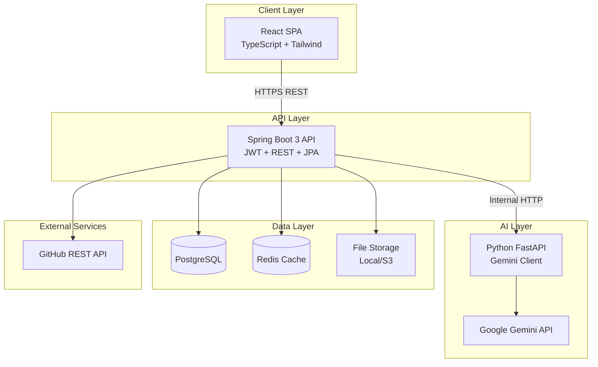
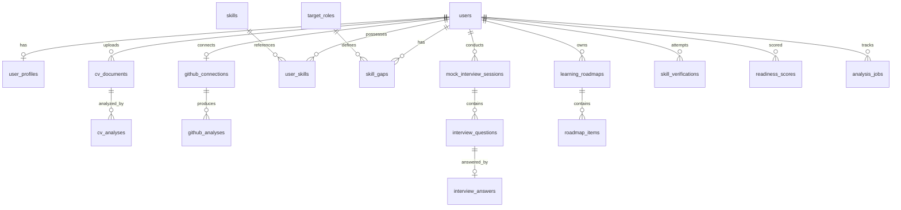
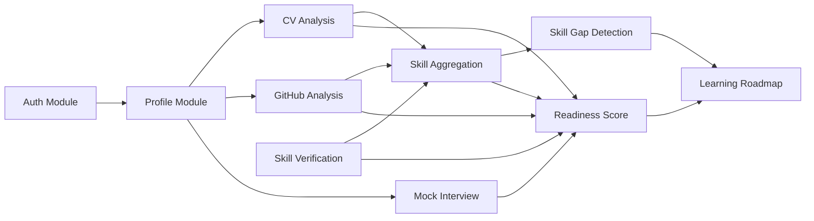

# CareerSucceX — System Architecture Design

## Design Assumptions

- **Primary users:** University students and internship seekers (18–24, CS/IT and related majors).
- **Deployment:** Docker Compose locally; GitHub Actions CI; AWS (ECS/RDS/S3) after MVP.
- **AI provider:** Google Gemini API via Python FastAPI service; Spring Boot orchestrates calls.
- **Auth:** JWT (access + refresh tokens); optional GitHub OAuth for repo analysis.
- **MVP scope:** Text-based mock interviews first; voice/STT deferred to Phase 3.

---

## 1. Functional Requirements

### FR-1: Authentication & User Profile
| ID | Requirement |
|----|-------------|
| FR-1.1 | Users register/login with email and password. |
| FR-1.2 | Users create a profile: name, university, degree, graduation year, target role, target industry. |
| FR-1.3 | Users connect GitHub via OAuth for repository analysis. |
| FR-1.4 | Users view a unified dashboard aggregating all scores and progress. |

### FR-2: CV Analysis & ATS Score
| ID | Requirement |
|----|-------------|
| FR-2.1 | Upload CV in PDF or DOCX (max 5 MB). |
| FR-2.2 | Extract text from PDF using Apache PDFBox (Spring Boot). |
| FR-2.3 | Parse structured fields: contact info, summary, education, experience, projects, skills. |
| FR-2.4 | Compute ATS score (0–100) against a target job description or default intern template. |
| FR-2.5 | Return keyword match report, missing keywords, section completeness, and formatting issues. |
| FR-2.6 | Store analysis history; allow re-analysis after CV update. |
| FR-2.7 | Provide AI-generated improvement suggestions (via Gemini). |

### FR-3: AI Mock Interviews
| ID | Requirement |
|----|-------------|
| FR-3.1 | Start a session by selecting role (e.g., Software Engineering Intern), difficulty, and type (behavioral/technical/mixed). |
| FR-3.2 | AI generates 5–10 contextual questions based on profile + target role. |
| FR-3.3 | User submits text answers per question. |
| FR-3.4 | AI evaluates each answer on relevance, clarity, structure (STAR), and technical accuracy. |
| FR-3.5 | Session summary with overall score, per-question feedback, and improvement tips. |
| FR-3.6 | View past sessions and track score trends. |

### FR-4: GitHub Repository Analysis
| ID | Requirement |
|----|-------------|
| FR-4.1 | Fetch public repos via GitHub REST API after OAuth. |
| FR-4.2 | Analyze: language distribution, commit frequency, repo count, stars/forks, README presence/quality. |
| FR-4.3 | Score project diversity (web, backend, mobile, ML, etc.). |
| FR-4.4 | Detect red flags: empty repos, fork-only profiles, long inactivity. |
| FR-4.5 | Generate portfolio improvement recommendations. |
| FR-4.6 | Refresh analysis on demand (rate-limited). |

### FR-5: Skill Gap Detection
| ID | Requirement |
|----|-------------|
| FR-5.1 | Maintain a skill taxonomy mapped to internship roles (e.g., React, Java, SQL, Git, DSA). |
| FR-5.2 | Aggregate user skills from CV parse, GitHub languages, self-assessment, and verifications. |
| FR-5.3 | Compare against a selected target role profile. |
| FR-5.4 | Output prioritized gaps: critical, recommended, nice-to-have. |
| FR-5.5 | Show skill confidence level per source. |

### FR-6: Internship Readiness Score
| ID | Requirement |
|----|-------------|
| FR-6.1 | Compute composite readiness score (0–100) from weighted sub-scores. |
| FR-6.2 | Sub-scores: CV/ATS (25%), GitHub (20%), Skills (25%), Mock Interview (20%), Verifications (10%). |
| FR-6.3 | Display breakdown chart and benchmark vs. typical intern profile. |
| FR-6.4 | Recalculate automatically when any sub-module data changes. |
| FR-6.5 | Provide actionable next steps to improve weakest dimension. |

### FR-7: Learning Roadmap
| ID | Requirement |
|----|-------------|
| FR-7.1 | Auto-generate a personalized roadmap from skill gaps and readiness weak areas. |
| FR-7.2 | Roadmap items: learn topic, build project, practice interview, verify skill. |
| FR-7.3 | Each item links to curated resources (docs, courses, project ideas). |
| FR-7.4 | Track item status: not started, in progress, completed. |
| FR-7.5 | Regenerate roadmap when target role or gaps change. |

### FR-8: Skill Verification
| ID | Requirement |
|----|-------------|
| FR-8.1 | Offer verification quizzes per skill (MCQ + short answer). |
| FR-8.2 | Optional coding challenge for programming skills (Phase 2). |
| FR-8.3 | AI grades open-ended responses. |
| FR-8.4 | Issue verified skill badge on passing threshold (e.g., ≥70%). |
| FR-8.5 | Verified skills feed into skill gap and readiness calculations. |

---

## 2. Non-Functional Requirements

### Performance
- API response (non-AI): p95 < 300 ms.
- CV upload + parse: < 10 s for a 2-page PDF.
- AI operations (CV suggestions, interview eval): p95 < 15 s; async job + polling for longer tasks.
- Dashboard load: < 2 s with cached readiness score.

### Scalability
- Support 1,000 concurrent users at MVP; stateless Spring Boot instances behind a load balancer.
- PostgreSQL connection pooling (HikariCP); Redis cache for readiness scores and GitHub data (TTL 24 h).

### Security
- JWT access token (15 min) + refresh token (7 days, httpOnly cookie).
- BCrypt password hashing; Spring Security role-based access.
- CV files stored encrypted at rest (S3 SSE or local encrypted volume).
- GitHub OAuth tokens encrypted in DB; never exposed to frontend.
- Rate limiting: 100 req/min per user; 5 CV uploads/day; 3 GitHub refreshes/day.
- Input validation on all endpoints; virus scan on uploads (ClamAV, Phase 2).

### Reliability
- 99.5% uptime target post-MVP.
- AI service circuit breaker (Resilience4j): fallback to cached/template responses on Gemini failure.
- Idempotent analysis jobs; retry with exponential backoff (max 3).

### Maintainability
- Modular monolith in Spring Boot with clear package boundaries per feature.
- OpenAPI 3 spec for both Spring Boot and FastAPI services.
- 80% unit test coverage on business logic; integration tests for critical flows.

### Usability
- Responsive UI (mobile-first Tailwind).
- Accessible (WCAG 2.1 AA): keyboard nav, ARIA labels, color contrast.
- Clear loading states for AI operations.

### Compliance & Privacy
- GDPR-style data export and account deletion.
- CV and interview data retained until user deletes; audit log for sensitive actions.

---

## 3. System Architecture

### High-Level Diagram



### Service Responsibilities

| Service | Responsibility |
|---------|----------------|
| **React SPA** | UI, routing, charts (Recharts), Axios API client, JWT storage |
| **Spring Boot** | Auth, business logic, CV parsing (PDFBox), GitHub integration, orchestration, file upload, readiness scoring |
| **Python FastAPI** | Gemini prompts, CV NLP enrichment, interview Q&A generation/evaluation, roadmap generation, skill quiz grading |
| **PostgreSQL** | Persistent data |
| **Redis** | Session cache, readiness score cache, rate limit counters |
| **File Storage** | CV PDFs/DOCX |

### Inter-Service Communication

- Spring Boot → FastAPI: synchronous REST over internal Docker network (`http://ai-service:8000`).
- Long AI jobs: Spring Boot creates `analysis_jobs` record, calls FastAPI async endpoint, FastAPI callback or polling via job ID.
- Shared contract: JSON schemas documented in OpenAPI; no shared DB between Java and Python.

### Key Architectural Patterns

- **Modular monolith** (Spring Boot) — one deployable JAR, feature packages isolated for future extraction.
- **BFF-lite** — Spring Boot is the single public API; frontend never calls FastAPI directly.
- **Event-driven recalculation** — completing CV analysis, GitHub sync, interview, or verification publishes internal event → readiness score recalculated.
- **Skill aggregation pipeline** — pluggable `SkillSource` adapters (CV, GitHub, SelfAssessment, Verification).

---

## 4. Database Schema

### Entity Relationship Overview



### Core Tables (PostgreSQL)

**users**
```sql
id              UUID PK
email           VARCHAR(255) UNIQUE NOT NULL
password_hash   VARCHAR(255) NOT NULL
role            VARCHAR(20) DEFAULT 'STUDENT'  -- STUDENT, ADMIN
is_active       BOOLEAN DEFAULT TRUE
created_at      TIMESTAMPTZ
updated_at      TIMESTAMPTZ
```

**user_profiles**
```sql
id              UUID PK
user_id         UUID FK → users UNIQUE
full_name       VARCHAR(150)
university      VARCHAR(200)
degree          VARCHAR(100)
graduation_year INT
target_role_id  UUID FK → target_roles
bio             TEXT
avatar_url      VARCHAR(500)
```

**cv_documents**
```sql
id              UUID PK
user_id         UUID FK → users
file_name       VARCHAR(255)
file_path       VARCHAR(500)
file_type       VARCHAR(10)  -- PDF, DOCX
file_size_bytes INT
uploaded_at     TIMESTAMPTZ
is_active       BOOLEAN DEFAULT TRUE
```

**cv_analyses**
```sql
id              UUID PK
cv_document_id  UUID FK → cv_documents
target_role_id  UUID FK → target_roles NULL
ats_score       DECIMAL(5,2)
keyword_score   DECIMAL(5,2)
format_score    DECIMAL(5,2)
completeness_score DECIMAL(5,2)
parsed_json     JSONB        -- structured CV data
keyword_report  JSONB        -- matched/missing keywords
suggestions     JSONB        -- AI suggestions
analyzed_at     TIMESTAMPTZ
```

**github_connections**
```sql
id              UUID PK
user_id         UUID FK → users UNIQUE
github_user_id  BIGINT
github_username VARCHAR(100)
access_token_enc TEXT         -- AES encrypted
connected_at    TIMESTAMPTZ
last_synced_at  TIMESTAMPTZ
```

**github_analyses**
```sql
id              UUID PK
connection_id   UUID FK → github_connections
overall_score   DECIMAL(5,2)
language_stats  JSONB
repo_stats      JSONB
activity_score  DECIMAL(5,2)
readme_score    DECIMAL(5,2)
diversity_score DECIMAL(5,2)
recommendations JSONB
analyzed_at     TIMESTAMPTZ
```

**skills** (taxonomy)
```sql
id              UUID PK
name            VARCHAR(100) UNIQUE
category        VARCHAR(50)  -- LANGUAGE, FRAMEWORK, TOOL, SOFT_SKILL
description     TEXT
```

**target_roles**
```sql
id              UUID PK
title           VARCHAR(100)  -- e.g., "Software Engineering Intern"
industry        VARCHAR(100)
required_skills JSONB         -- [{skill_id, weight, min_level}]
description     TEXT
```

**user_skills**
```sql
id              UUID PK
user_id         UUID FK → users
skill_id        UUID FK → skills
level           INT           -- 1-5
confidence      DECIMAL(3,2)  -- 0.0-1.0
source          VARCHAR(30)   -- CV, GITHUB, SELF, VERIFIED
source_ref_id   UUID NULL
updated_at      TIMESTAMPTZ
UNIQUE(user_id, skill_id, source)
```

**skill_gaps**
```sql
id              UUID PK
user_id         UUID FK → users
target_role_id  UUID FK → target_roles
skill_id        UUID FK → skills
priority        VARCHAR(20)   -- CRITICAL, RECOMMENDED, NICE_TO_HAVE
current_level   INT
required_level  INT
detected_at     TIMESTAMPTZ
```

**mock_interview_sessions**
```sql
id              UUID PK
user_id         UUID FK → users
target_role_id  UUID FK → target_roles
interview_type  VARCHAR(20)   -- BEHAVIORAL, TECHNICAL, MIXED
difficulty      VARCHAR(20)   -- EASY, MEDIUM, HARD
status          VARCHAR(20)   -- IN_PROGRESS, COMPLETED
overall_score   DECIMAL(5,2)
summary_feedback TEXT
started_at      TIMESTAMPTZ
completed_at    TIMESTAMPTZ
```

**interview_questions**
```sql
id              UUID PK
session_id      UUID FK → mock_interview_sessions
question_order  INT
question_text   TEXT
question_type   VARCHAR(20)
```

**interview_answers**
```sql
id              UUID PK
question_id     UUID FK → interview_questions UNIQUE
answer_text     TEXT
score           DECIMAL(5,2)
feedback        JSONB
answered_at     TIMESTAMPTZ
```

**learning_roadmaps**
```sql
id              UUID PK
user_id         UUID FK → users
target_role_id  UUID FK → target_roles
title           VARCHAR(200)
status          VARCHAR(20)   -- ACTIVE, ARCHIVED
generated_at    TIMESTAMPTZ
```

**roadmap_items**
```sql
id              UUID PK
roadmap_id      UUID FK → learning_roadmaps
skill_id        UUID FK → skills NULL
item_type       VARCHAR(30)   -- LEARN, PROJECT, INTERVIEW, VERIFY
title           VARCHAR(200)
description     TEXT
resources       JSONB
status          VARCHAR(20)   -- NOT_STARTED, IN_PROGRESS, COMPLETED
sort_order      INT
completed_at    TIMESTAMPTZ
```

**skill_verifications**
```sql
id              UUID PK
user_id         UUID FK → users
skill_id        UUID FK → skills
score           DECIMAL(5,2)
passed          BOOLEAN
attempt_number  INT
answers_json    JSONB
verified_at     TIMESTAMPTZ
```

**readiness_scores**
```sql
id              UUID PK
user_id         UUID FK → users
overall_score   DECIMAL(5,2)
cv_score        DECIMAL(5,2)
github_score    DECIMAL(5,2)
skills_score    DECIMAL(5,2)
interview_score DECIMAL(5,2)
verification_score DECIMAL(5,2)
breakdown_json  JSONB
calculated_at   TIMESTAMPTZ
```

**analysis_jobs**
```sql
id              UUID PK
user_id         UUID FK → users
job_type        VARCHAR(30)   -- CV_ANALYSIS, GITHUB_SYNC, ROADMAP_GEN
status          VARCHAR(20)   -- PENDING, RUNNING, COMPLETED, FAILED
result_ref_id   UUID NULL
error_message   TEXT
created_at      TIMESTAMPTZ
completed_at    TIMESTAMPTZ
```

### Indexes
- `users(email)`, `cv_analyses(cv_document_id)`, `user_skills(user_id)`, `readiness_scores(user_id, calculated_at DESC)`, `skill_gaps(user_id, target_role_id)`.

---

## 5. REST API Specifications

**Base URL:** `https://api.careersuccex.com/api/v1`  
**Auth header:** `Authorization: Bearer <access_token>`

### Auth (`/auth`)

| Method | Endpoint | Description |
|--------|----------|-------------|
| POST | `/auth/register` | Register `{email, password, fullName}` |
| POST | `/auth/login` | Login `{email, password}` → `{accessToken, refreshToken}` |
| POST | `/auth/refresh` | Refresh access token |
| POST | `/auth/logout` | Invalidate refresh token |
| GET | `/auth/me` | Current user + profile |

### Profile (`/profile`)

| Method | Endpoint | Description |
|--------|----------|-------------|
| GET | `/profile` | Get profile |
| PUT | `/profile` | Update profile |
| GET | `/profile/dashboard` | Aggregated scores, recent activity |

### CV Analysis (`/cv`)

| Method | Endpoint | Description |
|--------|----------|-------------|
| POST | `/cv/upload` | Multipart upload → `{documentId}` |
| GET | `/cv/documents` | List user's CVs |
| POST | `/cv/analyze` | `{documentId, targetRoleId?}` → triggers analysis |
| GET | `/cv/analyses/{id}` | Get analysis result |
| GET | `/cv/analyses` | List analysis history |
| DELETE | `/cv/documents/{id}` | Delete CV |

**Example: POST `/cv/analyze` response**
```json
{
  "analysisId": "uuid",
  "jobId": "uuid",
  "status": "PENDING"
}
```

**Example: GET `/cv/analyses/{id}` response**
```json
{
  "id": "uuid",
  "atsScore": 78.5,
  "breakdown": {
    "keywordScore": 72.0,
    "formatScore": 85.0,
    "completenessScore": 80.0
  },
  "keywordReport": {
    "matched": ["Java", "Spring Boot", "Git"],
    "missing": ["Docker", "CI/CD"]
  },
  "suggestions": ["Add quantifiable project outcomes", "Include Docker experience"],
  "parsedData": { "skills": [], "education": [], "experience": [] }
}
```

### Mock Interviews (`/interviews`)

| Method | Endpoint | Description |
|--------|----------|-------------|
| POST | `/interviews/sessions` | Start session `{targetRoleId, type, difficulty}` |
| GET | `/interviews/sessions/{id}` | Session with questions |
| POST | `/interviews/sessions/{id}/answers` | Submit `{questionId, answerText}` |
| POST | `/interviews/sessions/{id}/complete` | Finalize + get summary |
| GET | `/interviews/sessions` | Session history |

### GitHub (`/github`)

| Method | Endpoint | Description |
|--------|----------|-------------|
| GET | `/github/connect` | Redirect to GitHub OAuth |
| GET | `/github/callback` | OAuth callback |
| POST | `/github/analyze` | Trigger repo analysis |
| GET | `/github/analyses/latest` | Latest analysis |
| DELETE | `/github/disconnect` | Revoke connection |

### Skills & Gaps (`/skills`)

| Method | Endpoint | Description |
|--------|----------|-------------|
| GET | `/skills/taxonomy` | All skills (paginated, filterable) |
| GET | `/skills/mine` | User's aggregated skills |
| PUT | `/skills/self-assessment` | `[{skillId, level}]` |
| GET | `/skills/gaps?targetRoleId=` | Skill gap report |
| POST | `/skills/gaps/recalculate` | Force recalculation |

### Readiness (`/readiness`)

| Method | Endpoint | Description |
|--------|----------|-------------|
| GET | `/readiness/score` | Latest composite score + breakdown |
| GET | `/readiness/history` | Score over time (for charts) |
| GET | `/readiness/recommendations` | Top actions to improve |

### Learning Roadmap (`/roadmaps`)

| Method | Endpoint | Description |
|--------|----------|-------------|
| POST | `/roadmaps/generate` | `{targetRoleId}` → AI-generated roadmap |
| GET | `/roadmaps/active` | Current active roadmap with items |
| PATCH | `/roadmaps/items/{id}` | Update item status |
| GET | `/roadmaps/history` | Past roadmaps |

### Skill Verification (`/verifications`)

| Method | Endpoint | Description |
|--------|----------|-------------|
| POST | `/verifications/start` | `{skillId}` → `{verificationId, questions[]}` |
| POST | `/verifications/{id}/submit` | `{answers[]}` → `{score, passed, feedback}` |
| GET | `/verifications/history` | Past attempts |
| GET | `/verifications/badges` | Earned badges |

### Target Roles (`/roles`)

| Method | Endpoint | Description |
|--------|----------|-------------|
| GET | `/roles` | List internship target roles |
| GET | `/roles/{id}` | Role detail + required skills |

### Jobs (`/jobs`)

| Method | Endpoint | Description |
|--------|----------|-------------|
| GET | `/jobs/{id}` | Poll async job status |

### Python FastAPI Internal Endpoints (not public)

| Method | Endpoint | Description |
|--------|----------|-------------|
| POST | `/ai/cv/enrich` | NLP enrichment + suggestions |
| POST | `/ai/cv/ats-keywords` | Keyword extraction + matching |
| POST | `/ai/interview/generate-questions` | Generate interview questions |
| POST | `/ai/interview/evaluate-answer` | Score single answer |
| POST | `/ai/interview/summarize` | Session summary |
| POST | `/ai/roadmap/generate` | Generate roadmap items |
| POST | `/ai/verification/generate-quiz` | Generate quiz |
| POST | `/ai/verification/grade` | Grade answers |

---

## 6. Module Breakdown

### Repository Structure (Monorepo)

```
CareerSucceX/
├── frontend/                 # React + TypeScript + Tailwind
│   ├── src/
│   │   ├── api/              # Axios clients per domain
│   │   ├── components/       # Shared UI
│   │   ├── pages/            # Route pages
│   │   ├── hooks/
│   │   ├── context/          # AuthContext
│   │   └── types/
│   └── package.json
├── backend/                  # Spring Boot 3
│   ├── src/main/java/com/careersuccex/
│   │   ├── auth/
│   │   ├── profile/
│   │   ├── cv/
│   │   ├── interview/
│   │   ├── github/
│   │   ├── skills/
│   │   ├── readiness/
│   │   ├── roadmap/
│   │   ├── verification/
│   │   ├── common/           # exceptions, DTOs, utils
│   │   └── integration/      # FastAPI client, GitHub client
│   └── pom.xml
├── ai-service/               # Python FastAPI
│   ├── app/
│   │   ├── routers/
│   │   ├── services/         # Gemini prompt templates
│   │   ├── models/           # Pydantic schemas
│   │   └── prompts/
│   ├── requirements.txt
│   └── Dockerfile
├── docker-compose.yml
├── .github/workflows/ci.yml
└── docs/
    └── openapi/
```

### Module Dependency Map



| Module | Spring Packages | Key Classes | External Deps |
|--------|----------------|-------------|---------------|
| **Auth** | `auth/` | `AuthController`, `JwtService`, `SecurityConfig` | — |
| **Profile** | `profile/` | `ProfileService`, `DashboardService` | Auth |
| **CV Analysis** | `cv/` | `CvUploadService`, `PdfExtractService`, `CvAnalysisService` | PDFBox, FastAPI |
| **GitHub** | `github/` | `GitHubOAuthService`, `GitHubAnalysisService` | GitHub REST API |
| **Mock Interview** | `interview/` | `InterviewSessionService`, `AnswerEvaluationService` | FastAPI |
| **Skills** | `skills/` | `SkillAggregationService`, `SkillGapService` | CV, GitHub, Verify |
| **Readiness** | `readiness/` | `ReadinessCalculator`, `RecommendationEngine` | All score sources |
| **Roadmap** | `roadmap/` | `RoadmapGenerator`, `RoadmapProgressService` | FastAPI, Gaps |
| **Verification** | `verification/` | `QuizService`, `BadgeService` | FastAPI |
| **AI Integration** | `integration/ai/` | `AiServiceClient` (WebClient + circuit breaker) | FastAPI |

### Readiness Score Calculation (Core Algorithm)

```
overall = 0.25 * cvScore + 0.20 * githubScore + 0.25 * skillsScore
        + 0.20 * interviewScore + 0.10 * verificationScore

where:
  cvScore       = latest cv_analyses.ats_score (0 if none)
  githubScore   = latest github_analyses.overall_score (0 if not connected)
  skillsScore   = (matched_skills / required_skills) * 100 for target role
  interviewScore = avg of last 3 completed session overall_scores (0 if none)
  verificationScore = (verified_skills / required_skills) * 100
```

---

## 7. Development Roadmap

### Phase 1 — Foundation (Weeks 1–3)
- Scaffold monorepo: React app, Spring Boot project, FastAPI service, Docker Compose (Postgres + Redis).
- Implement Auth (register, login, JWT, refresh).
- User profile CRUD + dashboard shell.
- Seed `skills` and `target_roles` taxonomy (10 roles, ~80 skills).
- CI pipeline: lint, test, Docker build via GitHub Actions.
- **Deliverable:** Users can register, log in, set profile, see empty dashboard.

### Phase 2 — Core Analysis (Weeks 4–7)
- CV upload + PDFBox text extraction.
- FastAPI: CV enrichment + ATS keyword matching (Gemini).
- CV analysis flow with async jobs + polling.
- GitHub OAuth + repo fetch + analysis scoring.
- Skill aggregation pipeline (CV + GitHub sources).
- Skill gap detection vs. target role.
- **Deliverable:** CV ATS score, GitHub analysis, skill gap report on dashboard.

### Phase 3 — AI Interviews & Readiness (Weeks 8–10)
- Mock interview session flow (generate → answer → evaluate → summarize).
- Readiness score calculator + history chart (Recharts).
- Recommendation engine (weakest dimension → next actions).
- Redis caching for scores.
- **Deliverable:** Full mock interview experience; composite readiness score.

### Phase 4 — Roadmap & Verification (Weeks 11–13)
- AI-generated learning roadmaps from gaps.
- Roadmap progress tracking UI.
- Skill verification quizzes (MCQ + short answer grading via Gemini).
- Verified skills integrated into skill aggregation.
- **Deliverable:** Personalized roadmap + skill badges.

### Phase 5 — Polish & Pre-Launch (Weeks 14–16)
- Self-assessment skill UI.
- Data export + account deletion.
- Rate limiting, error handling, loading UX.
- E2E tests (Playwright) for critical flows.
- Performance tuning, security review.
- **Deliverable:** MVP ready for beta with university career center.

### Phase 6 — Post-MVP (Weeks 17+)
- AWS deployment (ECS Fargate, RDS, S3, CloudFront).
- DOCX CV support; coding challenges for verification.
- Voice-based mock interviews (Web Speech API + STT).
- Admin panel for taxonomy management.
- University B2B features (cohort analytics, bulk invite).

---

## Recommended First Implementation Step

Once approved, scaffold the monorepo with Docker Compose running PostgreSQL, Redis, Spring Boot, FastAPI, and React — then implement Auth + Profile as the vertical slice that validates the full stack.
